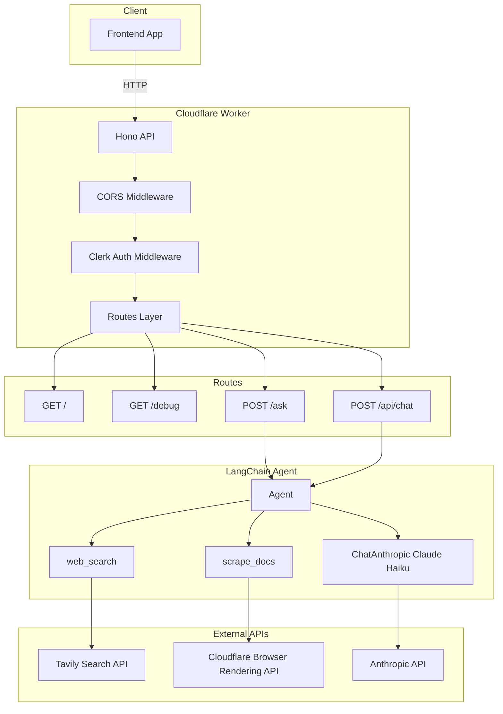

# DocPilot Backend

**DocPilot Backend** — An AI-powered documentation assistant API. Users ask questions about technologies, libraries, or frameworks; the backend searches the web for relevant docs (Tavily), scrapes them (Cloudflare Browser Rendering), and answers using Claude with source citations.

## Architecture



**Data flow:** Client → Hono (CORS + Clerk) → Routes → Agent (Claude + tools) → Tavily (search) + Cloudflare (scrape) → Response (JSON or streaming).

## Tools and Technologies

| Category | Tool | Purpose |
|----------|------|---------|
| Runtime | Cloudflare Workers | Edge deployment |
| Framework | Hono | Lightweight HTTP router |
| Auth | Clerk + @hono/clerk-auth | JWT validation for protected routes |
| AI/LLM | LangChain, Anthropic (Claude Haiku) | Agent orchestration, reasoning |
| Chat UI | Vercel AI SDK | Streaming responses for `useChat` |
| Search | Tavily API | Web search for doc URLs |
| Scraping | Cloudflare Browser Rendering | Convert docs to markdown |
| Tooling | Wrangler, Bun | Dev/deploy, package manager |

## API Routes

| Method | Path | Auth | Description |
|--------|------|------|-------------|
| GET | `/` | No | Health check |
| GET | `/debug` | Yes | Env/keys debug info |
| POST | `/ask` | Yes | One-shot Q&A `{ query }` → `{ answer }` |
| POST | `/api/chat` | Yes | Streaming chat `{ messages }` (AI SDK) |

## Environment Variables

Copy `.dev.vars.example` to `.dev.vars` and fill in your values. Required variables:

| Variable | Description |
|----------|-------------|
| `CLERK_SECRET_KEY` | Clerk secret key for auth |
| `CLERK_PUBLISHABLE_KEY` | Clerk publishable key |
| `ANTHROPIC_API_KEY` | Anthropic API key for Claude |
| `CF_ACCOUNT_ID` | Cloudflare account ID |
| `CF_API_TOKEN` | Cloudflare API token (Browser Rendering) |
| `CF_AI_GATEWAY_URL` | Cloudflare AI Gateway URL (optional) |
| `TAVILY_API_KEY` | Tavily API key for web search |

## Setup

**Prerequisites:** Node.js 18+ or [Bun](https://bun.sh)

```txt
npm install
npm run dev
```

**Clerk auth:** Protected routes (`/ask`, `/api/chat`, `/debug`) require a valid Clerk session. Add to `.dev.vars` (local) or Wrangler secrets (production):

```txt
CLERK_SECRET_KEY=sk_...
CLERK_PUBLISHABLE_KEY=pk_...
```

Your frontend must send the Clerk session token in the `Authorization: Bearer <token>` header. Use `getToken()` from `@clerk/clerk-react` (or your Clerk client) to obtain the token before each request.

## Deploy

```txt
npm run deploy
```

For production, set secrets via Wrangler:

```txt
wrangler secret put CLERK_SECRET_KEY
wrangler secret put ANTHROPIC_API_KEY
# ... etc for each secret
```

## Type Generation

[Generate types from your Worker configuration](https://developers.cloudflare.com/workers/wrangler/commands/#types):

```txt
npm run cf-typegen
```

Pass the `CloudflareBindings` as generics when instantiating `Hono`:

```ts
// src/index.ts
const app = new Hono<{ Bindings: CloudflareBindings }>()
```
